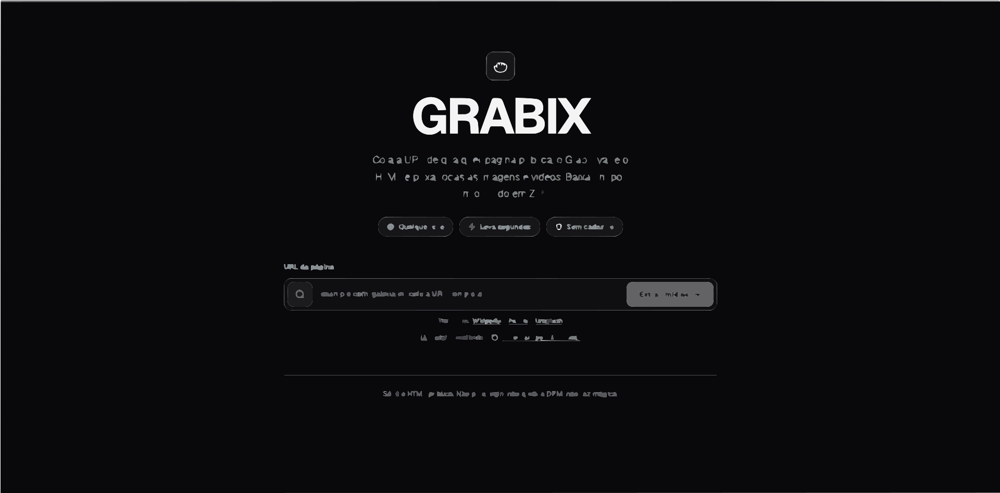

<div align="center">

<br />

# GRABIX

**Extract public media from any web page.**
<br />
Paste a URL, Grabix scans the HTML and pulls every image and video.
<br />
Download one by one or everything as a ZIP.

<br />

[](https://github.com/HanielCota/grabix/actions/workflows/ci.yml)
&ensp;[](LICENSE)
&ensp;[](https://nodejs.org/)
&ensp;[](https://nextjs.org/)
&ensp;[](https://react.dev/)
&ensp;[](https://tailwindcss.com/)
&ensp;[](https://www.typescriptlang.org/)

<br />



<br />

</div>

&nbsp;

## Features

<table>
  <tr>
    <td width="33%" valign="top">
      <h3>Any public page</h3>
      Paste any URL. Grabix fetches the HTML and extracts every <code>&lt;img&gt;</code>, <code>&lt;video&gt;</code>, <code>&lt;source&gt;</code>, <code>&lt;a&gt;</code> and lazy-load attribute it finds.
    </td>
    <td width="33%" valign="top">
      <h3>Smart extraction</h3>
      Handles <code>srcset</code>, <code>data-src</code>, <code>data-lazy-src</code>, <code>data-original</code>, <code>data-bg</code>, noscript fallbacks, and links pointing to media files.
    </td>
    <td width="33%" valign="top">
      <h3>Download as ZIP</h3>
      Pick individual files or batch everything into a streaming ZIP. No temp files, no memory bloat.
    </td>
  </tr>
  <tr>
    <td valign="top">
      <h3>Secure by default</h3>
      SSRF protection, DNS validation, private IP blocking, rate limiting, CSP headers, Zod validation on every endpoint.
    </td>
    <td valign="top">
      <h3>Fast and lightweight</h3>
      Server-side HTML parsing with Cheerio. No headless browser. No Puppeteer. Responses in seconds.
    </td>
    <td valign="top">
      <h3>Open source</h3>
      MIT licensed. Clean architecture. Easy to fork, customize, and extend.
    </td>
  </tr>
</table>

&nbsp;

## Quick Start

```bash
git clone https://github.com/HanielCota/grabix.git
cd grabix
npm install
npm run dev
```

Open **http://localhost:3000** and paste any public URL.

&nbsp;

## Scripts

| Command            | Description                      |
| ------------------ | -------------------------------- |
| `npm run dev`      | Development server with hot reload |
| `npm run build`    | Production build                 |
| `npm start`        | Start production server          |
| `npm run lint`     | Check code with Biome            |
| `npm run lint:fix` | Auto-fix lint issues             |
| `npm run format`   | Format all files with Biome      |

&nbsp;

## Tech Stack

<table>
  <tr>
    <td width="50%" valign="top">

| Role           | Technology            | Version |
| -------------- | --------------------- | ------- |
| **Framework**  | Next.js (App Router)  | 16      |
| **UI**         | React                 | 19      |
| **Language**   | TypeScript            | 6       |
| **Styling**    | Tailwind CSS          | 4       |
| **Animations** | Motion                | 12      |
| **Icons**      | Lucide React          | 1.7     |

</td>
    <td width="50%" valign="top">

| Role              | Technology | Version |
| ----------------- | ---------- | ------- |
| **Validation**    | Zod        | 4       |
| **HTML Parser**   | Cheerio    | 1.2     |
| **ZIP**           | Archiver   | 7       |
| **Lint + Format** | Biome      | 2.4     |
| **Runtime**       | Node.js    | >= 20   |

</td>
  </tr>
</table>

&nbsp;

## Supported Media

| Type   | Extensions                                  |
| ------ | ------------------------------------------- |
| Images | `jpg` `jpeg` `png` `webp` `gif` `svg`      |
| Videos | `mp4` `webm` `mov` `m4v`                   |

> Lazy-load attributes: `src` `data-src` `data-lazy-src` `data-original` `data-bg` `srcset` `data-srcset` `data-lazy-srcset`

&nbsp;

<details>
<summary><strong>&nbsp;Project Structure</strong></summary>

&nbsp;

```text
grabix/
├── src/
│   ├── app/                                 # Next.js App Router
│   │   ├── api/
│   │   │   ├── analyze/route.ts             # POST  analyze page, return media
│   │   │   ├── download/route.ts            # GET   download single file
│   │   │   └── download-zip/route.ts        # POST  batch download as ZIP
│   │   ├── layout.tsx                       # root layout
│   │   ├── page.tsx                         # homepage
│   │   ├── error.tsx                        # global error boundary
│   │   ├── not-found.tsx                    # 404
│   │   └── globals.css                      # theme + CSS variables
│   │
│   ├── features/media-downloader/
│   │   ├── components/                      # React client components
│   │   │   ├── media-downloader.tsx         # main container
│   │   │   ├── media-gallery.tsx            # results grid + stats
│   │   │   ├── media-card.tsx               # single media card
│   │   │   ├── media-filters.tsx            # image / video tabs
│   │   │   ├── url-input.tsx                # URL input form
│   │   │   └── error-message.tsx            # error alert
│   │   ├── application/                     # use cases
│   │   │   ├── analyze-page.ts
│   │   │   ├── download-asset.ts
│   │   │   └── download-zip.ts
│   │   ├── domain/                          # types, schemas, rules
│   │   │   ├── types.ts
│   │   │   ├── errors.ts
│   │   │   └── media-extensions.ts
│   │   └── infrastructure/                  # external integrations
│   │       ├── html-fetcher.ts
│   │       └── media-extractor.ts
│   │
│   ├── server/
│   │   ├── config.ts                        # limits, timeouts
│   │   ├── security.ts                      # SSRF + DNS validation
│   │   └── api-utils.ts                     # error handler
│   │
│   └── proxy.ts                             # rate limiting + method guard
│
├── biome.json
├── next.config.ts                           # security headers
├── tsconfig.json
└── package.json
```

</details>

&nbsp;

<details>
<summary><strong>&nbsp;Architecture</strong></summary>

&nbsp;

```text
┌─────────────────────────────────────────────────────────────┐
│  Client (React 19)                                          │
│                                                             │
│  UrlInput  →  MediaDownloader  →  Gallery  →  MediaCard     │
└────────────────────────┬────────────────────────────────────┘
                         │ fetch
┌────────────────────────▼────────────────────────────────────┐
│  Proxy  (rate limit · 30 req/min · method enforcement)      │
└────────────────────────┬────────────────────────────────────┘
                         │
┌────────────────────────▼────────────────────────────────────┐
│  API Routes                                                 │
│                                                             │
│  POST /api/analyze    GET /api/download    POST /api/zip    │
│       │                    │                    │           │
│  ┌────▼────────────────────▼────────────────────▼───────┐   │
│  │              Zod Schema Validation                   │   │
│  └────┬────────────────────┬────────────────────┬───────┘   │
│       │                    │                    │           │
│  ┌────▼─────┐  ┌──────────▼─────┐  ┌──────────▼────────┐   │
│  │ Security │  │   Security     │  │   Security        │   │
│  │ SSRF+DNS │  │   SSRF+DNS    │  │   SSRF+DNS       │   │
│  └────┬─────┘  └──────────┬─────┘  └──────────┬────────┘   │
│       │                   │                    │           │
│  ┌────▼─────┐  ┌──────────▼─────┐  ┌──────────▼────────┐   │
│  │ Cheerio  │  │  Stream +     │  │  Archiver         │   │
│  │ HTML     │  │  Size Limit   │  │  ZIP Stream       │   │
│  └──────────┘  └────────────────┘  └───────────────────┘   │
└─────────────────────────────────────────────────────────────┘
```

**Design decisions:**

- **Feature-based** &mdash; media-downloader code grouped by functionality, not file type
- **Domain isolation** &mdash; types and business rules have zero external dependencies
- **Security by default** &mdash; SSRF, DNS validation, and input validation on every endpoint
- **Streaming** &mdash; ZIP generated incrementally, never buffered in memory

</details>

&nbsp;

## Security

| Layer                  | What it does                                                                            |
| ---------------------- | --------------------------------------------------------------------------------------- |
| **SSRF Protection**    | Private IPs, localhost, link-local blocked. DNS validated before every request.          |
| **Input Validation**   | Zod schemas on all API inputs. Path traversal checks on filenames. Extension allowlist.  |
| **Rate Limiting**      | 30 req/min per IP on all API routes via proxy middleware.                                |
| **Security Headers**   | CSP, X-Frame-Options (DENY), X-Content-Type-Options, Referrer-Policy.                   |
| **Download Safety**    | Content-Type validation, 100 MB file limit, byte-counting stream wrapper.               |
| **Protocol**           | HTTP and HTTPS only. No `file://`, `ftp://`, or other schemes.                          |

&nbsp;

## Configuration

All limits in **`src/server/config.ts`**:

```typescript
export const appConfig = {
  limits: {
    fetchTimeoutMs: 15_000,              // 15s per request
    maxHtmlSizeBytes: 10 * 1024 * 1024,  // 10 MB max HTML
    maxAssets: 200,                       // max media per analysis
    maxFileSizeBytes: 100 * 1024 * 1024, // 100 MB per file
    maxConcurrentDownloads: 5,           // parallel downloads in ZIP
  },
};
```

<details>
<summary><strong>&nbsp;Customization points</strong></summary>

&nbsp;

| What                 | Where                                                               |
| -------------------- | ------------------------------------------------------------------- |
| Theme, CSS variables | `src/app/globals.css`                                               |
| Security rules       | `src/server/security.ts`                                            |
| Supported formats    | `src/features/media-downloader/domain/media-extensions.ts`          |
| API schemas          | `src/features/media-downloader/domain/types.ts`                     |
| Rate limit           | `src/proxy.ts`                                                      |

</details>

&nbsp;

## Lint & Formatting

[Biome](https://biomejs.dev/) handles both linting and formatting. No ESLint. No Prettier.

```bash
npm run lint         # check
npm run lint:fix     # auto-fix
npm run format       # format
```

&nbsp;

## Contributing

See **[CONTRIBUTING.md](CONTRIBUTING.md)** for the full guide. Quick version:

```bash
# Fork, clone, install
git clone https://github.com/YOUR_USERNAME/grabix.git
cd grabix && npm install

# Branch, code, validate
git checkout -b feat/your-feature
npm run lint && npm run build

# Commit, push, open PR
git commit -m "feat: your feature"
git push origin feat/your-feature
```

**Merge:** squash merge
&ensp;|&ensp;**Branches:** `feat/` `fix/` `docs/` `chore/`
&ensp;|&ensp;**Commits:** [Conventional Commits](https://www.conventionalcommits.org/)

&nbsp;

## Roadmap

- [x] JavaScript rendering (Playwright) for SPAs — optional, via `GRABIX_JS_RENDERING=true`
- [x] More selectors (`<picture>`, CSS `background-image`)
- [x] Environment variable configuration (`.env.example`)
- [ ] Async queue for heavy analyses
- [ ] Result persistence with database
- [ ] User session and history
- [ ] Authentication and access control
- [ ] Temporary storage (S3 / R2) for caching
- [ ] Structured logging and observability
- [ ] Redis-backed rate limiting

&nbsp;

## License

[MIT](LICENSE) &copy; [HanielCota](https://github.com/HanielCota)

---

<div align="center">
<sub>Built with Next.js 16 &middot; React 19 &middot; TypeScript 6 &middot; Tailwind CSS 4 &middot; Biome</sub>
</div>
